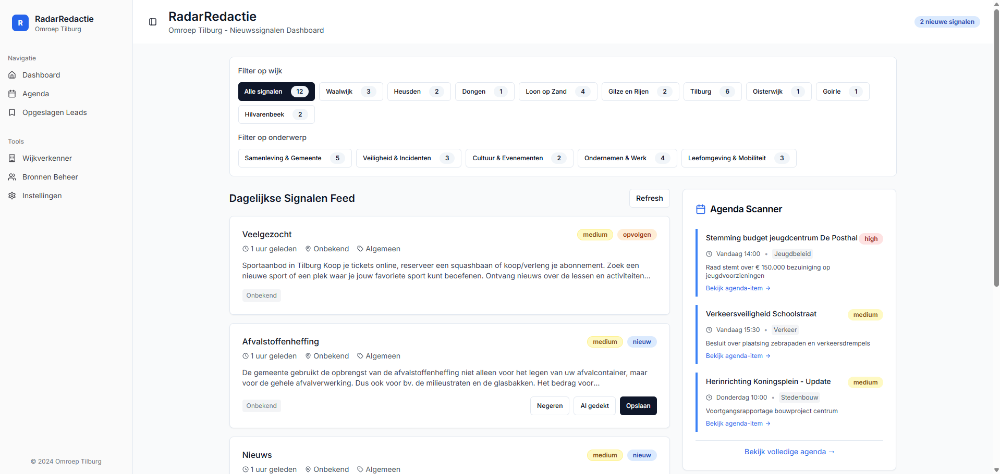

# RedactieRadar


---

## 🧭 Overview

**RedactieRadar** is a modern newsroom dashboard application for regional journalists to track local signals, scan news sources, and manage editorial priorities. Built with React, Supabase, and Vite, the tool enables efficient signal processing and lead management within a collaborative environment.

---

## 🖼️ Screenshot



---

## 🔧 Setup Instructions

### 1. Clone the Repository

```bash
git clone https://github.com/cindybruikman/radar-redactie.git
cd radar-redactie
```

### 2. Install Dependencies

```bash
npm install
```

### 3. Environment Setup

Create a `.env` file in the root directory and add your Supabase credentials:

```env
VITE_SUPABASE_URL=your-supabase-url
VITE_SUPABASE_ANON_KEY=your-supabase-anon-key
```

> ⚠️ Replace with your actual Supabase project credentials.

---

### 4. Start the Development Server

```bash
npm run dev
```

Then go to [http://localhost:3000](http://localhost:3000)

---

### 5. Production Build

```bash
npm run build
npm run preview
```

---

## 🛠 Scripts

| Command             | Description                  |
| ------------------- | ---------------------------- |
| `npm run dev`       | Start local dev server       |
| `npm run build`     | Create production build      |
| `npm run preview`   | Preview built app locally    |
| `npm run lint`      | Run ESLint on codebase       |

---

## 📄 License

MIT License
